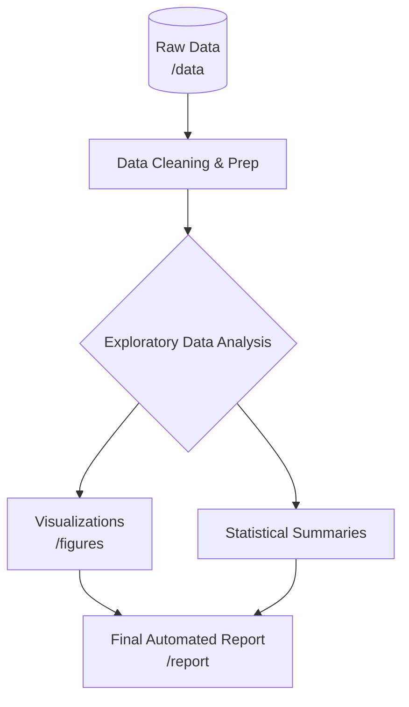

# Bike Sharing Demand - Exploratory Data Analysis (EDA)

Welcome to the **Bike Sharing Demand** analysis project! This repository contains an end-to-end Exploratory Data Analysis (EDA) and visualization pipeline built to uncover the hidden patterns in hourly bike rental data.

## 📌 Project Overview
The goal of this project is to understand the primary drivers of bike-sharing demand. By cleaning the raw data, treating outliers, and building insightful visualizations, we explore how factors like seasonality, time of day, and weather conditions impact ridership—and how casual riders differ from registered subscribers.

## 🏗️ Project Architecture

The project follows a structured data pipeline architecture, taking raw data through cleaning, analysis, and automated reporting.



### Directory Structure
- **`/data`**: Contains the raw dataset (`bike_sharing.csv`).
- **`/notebooks`**: Contains the interactive Jupyter Notebook (`eda_analysis.ipynb`) for step-by-step visual analysis.
- **`/src`**: Contains the production-ready Python script (`eda_analysis.py`) that automates the entire EDA pipeline and document generation.
- **`/figures`**: Stores all high-resolution `.png` charts generated during the EDA.
- **`/report`**: Contains the final, automatically generated Microsoft Word document (`EDA_Report.docx`).
- **`requirements.txt`**: List of required Python packages to reproduce this environment.

## 📊 Dataset Information
- **Source**: UCI Machine Learning Repository
- **Size**: 17,379 rows, 17 columns
- **Features**: Time-series elements (date, hour, season), environmental factors (temperature, humidity, windspeed), and user segments (casual vs. registered).

## 🚀 How to Run the Project
1. Clone the repository to your local machine.
2. Install the required dependencies:
   ```bash
   pip install -r requirements.txt
   ```
3. Run the automated Python script to generate all figures and the `.docx` report from scratch:
   ```bash
   python src/eda_analysis.py
   ```
4. Alternatively, explore the data interactively by opening the Jupyter Notebook located in the `/notebooks` directory.

## 💡 Key Findings
- **The Daily Commute is King**: Registered users heavily drive peak demand at 8 AM and 5 PM on weekdays.
- **Weekends Are for the Casuals**: Casual riders prefer weekend afternoons and behave completely differently than weekday commuters.
- **Weather Sensitivity**: Warm, clear weather positively impacts rentals, while extreme heat, humidity, and precipitation severely deter casual riders.
